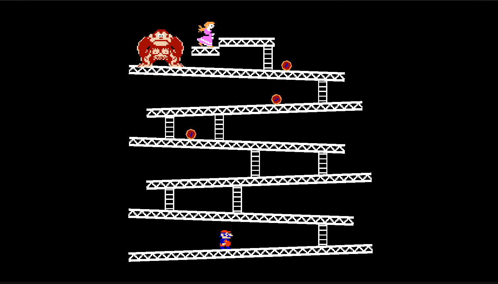
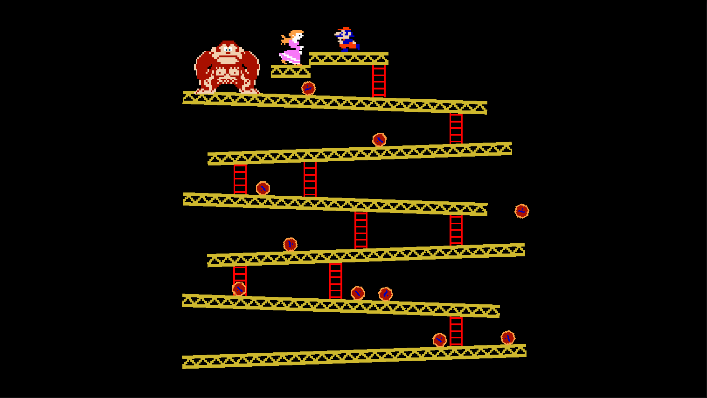

# Barrel Rush

A clone of the original **Donkey Kong** arcade game (Nintendo, 1981), built in Unity 6. This isn't an original game — it's a recreation of the real thing, made for learning purposes. All characters and gameplay are based on the original.

Made this to get hands-on with 2D physics, sprite animation, and scene management in Unity. Nothing fancy, just trying to replicate what the original did.

## Gameplay

You're Mario. Donkey Kong is at the top throwing barrels at you. Get to the princess without getting hit. That's pretty much it.

Barrels roll down the platforms and bounce off the edges. Use ladders to move between floors. Jump over barrels or time your climbs to avoid them.

**Controls**
- Move: Arrow keys or WASD
- Jump: Space
- Climb: Up / Down while on a ladder

3 lives. Each barrel hit costs one. Reach the princess and you gain 1000 points and move to the next level.

## Screenshots

| Level 1 | Level 2 |
|---|---|
|  |  |

## Built With

- Unity 6.4 (6000.4.4f1)
- Universal Render Pipeline (URP) 2D

## How to Run

1. Clone the repo
2. Open in Unity Hub with Unity 6.4
3. Open the `Preload` scene and hit Play
